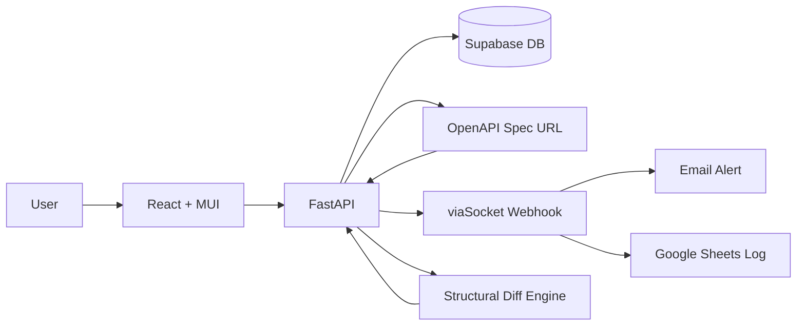

# IKIGAI Judging Brief — NovaGrid API Guardian

**Track:** Open Innovation — Non-CS branches
**Problem:** Detect API changes in third-party services before they break production code, using structured OpenAPI spec comparison instead of AI.
**Repository assessment:** Working end-to-end system with frontend, backend, database, and external notification integration.

---

## What They Built

- A web application that monitors public APIs by registering their OpenAPI spec URLs and auto-discovering all endpoints
- A structural diff engine that compares old vs new OpenAPI specs field-by-field to classify changes as Breaking or Safe
- An interactive SVG tree graph that visualizes all endpoints grouped by tags
- A human validation workflow where detected changes require explicit approval before being acted on
- Integration with viaSocket for email alerts and Google Sheets for logging when changes are detected
- An AST-based route scanner that parses Python/FastAPI source code to extract endpoint metadata without requiring an OpenAPI spec

---

## Architecture

---

## Core Capability Check

| Capability | Status | Evidence |
|------------|--------|----------|
| API Registration & Discovery | ✅ Verified | `Backend/app/api/public_apis.py` — `register_public_api()` fetches and parses OpenAPI specs |
| OpenAPI Diff Engine | ✅ Verified | `Backend/app/openapi_parser.py` — `compare_specs()` does field-by-field structural comparison |
| Tree Graph Visualization | ✅ Verified | `Frontend/src/components/TreeGraph.jsx` — SVG layout engine with router cards and endpoint nodes |
| Human Validation | ✅ Verified | `Backend/app/api/endpoint_tree.py` — `approve_change()` and `reject_change()` with status tracking |
| Email Notifications | ✅ Verified | `Backend/app/viasocket.py` — `send_webhook()` posts to viaSocket URL |
| AST Route Scanner | ✅ Verified | `Backend/app/route_scanner.py` — `scan_file()` uses Python `ast` module to extract FastAPI routes |
| Auth (Login/Signup) | ✅ Verified | `Backend/app/main.py` — Supabase auth integration with signup/login/logout |

---

## Technical Read

**Strongest technical aspect:** The OpenAPI diff engine is well-implemented — `compare_specs()` handles endpoint additions/removals, field type changes, path parameter removals, and deprecated flags with proper Breaking vs Safe classification, all without AI.

**Biggest technical concern:** The diff engine compares endpoint lists correctly but does not deep-compare response schemas or nested object structures — a field type change inside a response schema would be missed.

**Core workflow:** Complete — Register → Fetch → Parse → Store → Compare → Detect → Alert → Review → Approve/Reject

**Implementation confidence:** High — the core flow is implemented end-to-end and can be demonstrated with Petstore or httpbin.

---

## Track-Specific Checks (Open Innovation)

**Core technical challenge:** Building a reliable API change detection system that can classify breaking vs safe changes without AI, using only structured OpenAPI spec comparison.

| Check | Assessment |
|-------|------------|
| Relationship between technology and problem | Direct — the diff engine solves silent API breakage by detecting changes before production code fails |
| Data sources | OpenAPI/Swagger JSON specs fetched from public URLs |
| Realistic deployment assumptions | Requires APIs to publish OpenAPI specs (most major APIs do) |
| Accessibility in intended environment | Web-based — accessible from any browser; no special hardware needed |
| Domain relevance | API governance is a cross-cutting concern for any software team using third-party services |

---

## Technical Review

**Does the core solution exist?** Yes. The repository implements a working API change detection system with an OpenAPI diff engine, tree visualization, and human validation workflow.

**Is it end-to-end?** Yes. The flow is complete: register API → fetch spec → parse endpoints → store in DB → compare with stored version → detect changes → send notification → review in UI → approve/reject.

**Is the architecture sensible?** Yes. Clean separation: React frontend → FastAPI backend → Supabase database. The diff engine is isolated in `openapi_parser.py`, the route scanner in `route_scanner.py`, and notifications in `viasocket.py`. No unnecessary complexity.

**Are the technologies appropriate?** Yes. FastAPI for the backend is lightweight and fast. Supabase handles auth + database without self-hosting. React + MUI for the frontend is standard. viaSocket for webhooks is a simple HTTP POST — no heavy dependencies.

**What is technically interesting?** The structural diff engine (`compare_specs()`) classifies API changes as Breaking or Safe using pure JSON comparison without AI — handling endpoint additions/removals, field type changes, path parameter removals, and deprecation flags. The AST-based route scanner (`route_scanner.py`) parses Python source code to extract FastAPI endpoint metadata without requiring an OpenAPI spec.

---

## Judge Metrics

| Metric | Assessment |
|--------|-------------|
| Core workflow |  |
| Implementation confidence |  |
| Technical ambition |  |
| Architecture quality |  |
| Engineering quality |  |
| Demo risk |  |

---

## IKIGAI Score

| Criterion | Weight | Score |
|-----------|---------|-------|
| Innovation & Creativity | 25 |  |
| Technical Implementation | 30 |  |
| Problem Solving | 20 |  |
| UI/UX & Presentation | 10 |  |
| Impact & Scalability | 15 |  |
| **Total** | **100** |  |
