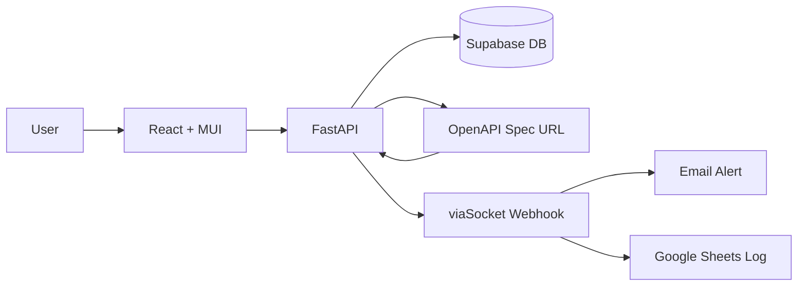

# NovaGrid API Guardian

**Track:** Open Innovation — Non-CS branches
**Problem:** Detect API changes in third-party services before they break production code, using structured OpenAPI spec comparison instead of AI.
**Repository assessment:** Working end-to-end system with frontend, backend, database, and external notification integration.

---

## What They Built

- Web app that monitors public APIs by registering OpenAPI spec URLs and auto-discovering endpoints
- Structural diff engine comparing old vs new specs field-by-field (Breaking vs Safe classification)
- Interactive SVG tree graph visualizing endpoints grouped by tags
- Human validation workflow — changes require explicit approval before action
- viaSocket email alerts + Google Sheets logging on change detection
- AST-based route scanner extracting FastAPI endpoint metadata from Python source

---

## Architecture

---

## Core Capability Check

| Capability | Status | Evidence |
|------------|--------|----------|
| API Registration & Discovery | ✅ Verified | `Backend/app/api/public_apis.py` |
| OpenAPI Diff Engine | ✅ Verified | `Backend/app/openapi_parser.py` |
| Tree Graph Visualization | ✅ Verified | `Frontend/src/components/TreeGraph.jsx` |
| Human Validation | ✅ Verified | `Backend/app/api/endpoint_tree.py` |
| Email Notifications | ✅ Verified | `Backend/app/viasocket.py` |
| AST Route Scanner | ✅ Verified | `Backend/app/route_scanner.py` |
| Auth (Login/Signup) | ✅ Verified | `Backend/app/main.py` |

---

## Technical Review

**Strongest aspect:** Diff engine handles endpoint add/remove, field type changes, param removal, and deprecation — all without AI, using pure JSON comparison.

**Biggest concern:** Does not deep-compare nested response schemas — a field type change inside a response object would be missed.

**Core workflow:** Complete — Register → Fetch → Parse → Store → Compare → Detect → Alert → Review → Approve/Reject

**Implementation confidence:** High — demonstrable with Petstore or httpbin out of the box.

---

## Track-Specific Checks (Open Innovation)

| Check | Assessment |
|-------|------------|
| Technology-problem fit | Diff engine directly solves silent API breakage |
| Data sources | OpenAPI/Swagger JSON specs from public URLs |
| Deployment assumptions | Requires APIs to publish OpenAPI specs (most major APIs do) |
| Accessibility | Web-based, any browser, no special hardware |

---

## Questions for the Team

1. The diff engine in `openapi_parser.py:compare_specs()` compares endpoint-level changes but does not recursively compare response schemas — how would you handle a nested field type change inside a response object?
2. The `check_for_changes` endpoint fetches the live spec on every request — what happens if the OpenAPI URL is rate-limited or goes down during a check?
3. The human validation page shows approve/reject buttons but the backend `approve_change()` only updates a status field — what downstream action happens after approval?

---

## Judge Metrics

| Metric | Assessment |
|--------|------------|
| Core workflow |  |
| Implementation confidence |  |
| Technical ambition | /5 |
| Architecture quality | /5 |
| Engineering quality | /5 |
| Demo risk |  |

---

## IKIGAI Score

| Criterion | Weight | Score |
|-----------|---------|-------|
| Innovation & Creativity | 25 |  |
| Technical Implementation | 30 |  |
| Problem Solving | 20 |  |
| UI/UX & Presentation | 10 |  |
| Impact & Scalability | 15 |  |
| **Total** | **100** |  |
