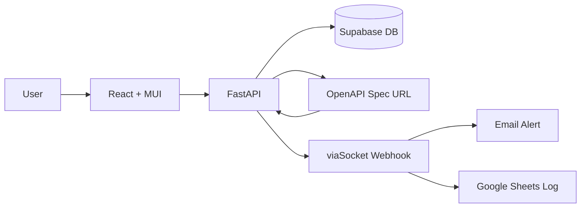

# NovaGrid API Guardian

**Track:** Open Innovation — Non-CS branches
**Problem:** Detect API changes in third-party services before they break production code, using structured OpenAPI spec comparison instead of AI.
**Repository assessment:** Working end-to-end system with frontend, backend, database, and external notification integration.

---

## What We Built

- Web app that monitors public APIs by registering OpenAPI spec URLs and auto-discovering endpoints
- Structural diff engine comparing old vs new specs field-by-field (Breaking vs Safe classification)
- Interactive SVG tree graph visualizing endpoints grouped by tags
- Human validation workflow — changes require explicit approval before action
- viaSocket email alerts + Google Sheets logging on change detection
- AST-based route scanner extracting FastAPI endpoint metadata from Python source

---

## Architecture

---

## Repository Assessment

| Capability | Status | Evidence |
|------------|--------|----------|
| API Registration & Discovery | ✅ Verified | `public_apis.py` — fetches and parses OpenAPI specs |
| OpenAPI Diff Engine | ✅ Verified | `openapi_parser.py` — field-by-field structural comparison |
| Tree Graph Visualization | ✅ Verified | `TreeGraph.jsx` — SVG layout with router cards |
| Human Validation | ✅ Verified | `endpoint_tree.py` — approve/reject with status tracking |
| Email Notifications | ✅ Verified | `viasocket.py` — webhook POST integration |
| AST Route Scanner | ✅ Verified | `route_scanner.py` — Python AST-based extraction |
| Auth (Login/Signup) | ✅ Verified | `main.py` — Supabase auth integration |

---

## Technical Review

- Does the core solution exist? ✅ Working API change detection with diff engine, tree visualization, and human validation.
- Is it end-to-end? ✅ Register → Fetch → Parse → Store → Compare → Detect → Alert → Review → Approve/Reject.
- Is the architecture sensible? ✅ Clean separation: React → FastAPI → Supabase. No unnecessary complexity.
- Are the technologies appropriate? ✅ FastAPI, Supabase, React+MUI, viaSocket — all lightweight and fit for purpose.
- What is technically interesting? Structural diff engine classifies Breaking vs Safe without AI using pure JSON comparison.

---

## Track-Specific Checks (Open Innovation)

| Check | Assessment |
|-------|------------|
| Technology-problem fit | Diff engine directly solves silent API breakage |
| Data sources | OpenAPI/Swagger JSON specs from public URLs |
| Deployment assumptions | Requires APIs to publish OpenAPI specs (most major APIs do) |
| Accessibility | Web-based, any browser, no special hardware |

---

## Judge Metrics

| Metric | Assessment |
|--------|------------|
| Core workflow |  |
| Implementation confidence |  |
| Technical ambition | /5 |
| Architecture quality | /5 |
| Engineering quality | /5 |
| Demo risk |  |

---

## IKIGAI Score

| Criterion | Weight | Score |
|-----------|---------|-------|
| Innovation & Creativity | 25 |  |
| Technical Implementation | 30 |  |
| Problem Solving | 20 |  |
| UI/UX & Presentation | 10 |  |
| Impact & Scalability | 15 |  |
| **Total** | **100** |  |

---

## Questions for the Team

1. We built `compare_specs()` in `openapi_parser.py` to classify changes as Breaking or Safe — how did you decide which changes are breaking versus safe, and what edge cases did you encounter during testing?
2. We built the AST route scanner in `route_scanner.py` to extract FastAPI endpoints from source code — how does this complement the OpenAPI spec approach, and when would you use one over the other?
3. We built the human validation workflow in `endpoint_tree.py` with approve/reject — how does this ensure no breaking changes are applied without human review, and what happens after approval?
4. We built the interactive tree graph in `TreeGraph.jsx` to visualize endpoint hierarchies — how does this help developers understand their API structure at a glance?
5. We built the viaSocket integration in `viasocket.py` for email notifications — how does this close the loop between change detection and human action?
